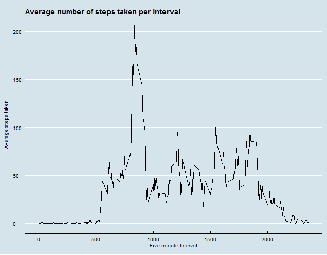

<style type="text/css">

body  {
   padding-top: 1em;
   margin: auto; 
   max-width: 60em; 
}


p {
  font-family: Calibri;
  font-size: 11pt;
  /* width: 99%; */
  margin-bottom: 10pt;
}

table {
  margin: auto;
  margin-top: 1em;
  margin-bottom: 1em;
  border: none;
}

caption {
  padding: 0 0 10px 0;
  width: 700px;   
	font: italic 11px "Trebuchet MS", Verdana, Arial, Helvetica, sans-serif;
	text-align: right;
}

th {
	font: bold 11px "Trebuchet MS", Verdana, Arial, Helvetica, sans-serif;
	color: #4f6b72;
	border-right: 1px solid #C1DAD7;
	border-bottom: 1px solid #C1DAD7;
	border-top: 1px solid #C1DAD7;
	letter-spacing: 2px;
	text-align: left;
	padding: 3px 3px 3px 3px;
	background: #D6E7EF url(images/bg_header.jpg) no-repeat;
  /*  #CAE8EA  */
}

th.nobg {
	border-top: 0;
	border-left: 0;
	border-right: 1px solid #C1DAD7;
	background: none;
}

td {
	border-right: 1px solid #C1DAD7;
	border-bottom: 1px solid #C1DAD7;
	background: #fff;
	padding: 3px 3px 3px 3px;
	color: #4f6b72;
}

td.alt {
	background: #F5FAFA;
	color: #797268;
}

th.spec {
	border-left: 1px solid #C1DAD7;
	border-top: 0;
	background: #fff url(images/bullet1.gif) no-repeat;
	font: bold 10px "Trebuchet MS", Verdana, Arial, Helvetica, sans-serif;
}

th.specalt {
	border-left: 1px solid #C1DAD7;
	border-top: 0;
	background: #f5fafa url(images/bullet2.gif) no-repeat;
	font: bold 10px "Trebuchet MS", Verdana, Arial, Helvetica, sans-serif;
	color: #797268;
}

/* Set the headings to correspond to Word-style */
h1, h2, h3, h4, h5, h6 {
  /* margin: 4pt 0pt 6pt 0pt; */
  font-family: Cambria;
  font-weight: bold;
}
 
/* h1 has a slightly larger top margins 
   so we re-set that from the other*/
h1 {
  /* margin: 24pt 0pt 6pt 0pt; */
  font-size: 14pt;
  color: #365F91;
}
 
 
h2 {
  font-size: 13pt;
  color: #3A7296 /* #4F81BD; 407396 566D8C 3A7296 496F85 4B7C89 */
}
 
h3 {
  font-size: 12pt;
  color: #3A7296 /* #4F81BD; */
}
 
h4 {
  font-size: 12pt;
  font-weight: lighter;
  font-style: italic;
  color: #3A7296 /* #4F81BD; */
}
 
h5 {
  font-size: 11pt;
  font-weight: normal;
  color: #243F5D;
}
 
h6 {
  font-size: 11pt;
  font-weight: normal;
  font-style: italic;
  color: #243F5D;
}

div.centered 
{
  font-family: Calibri;
  font-size: 12pt;
  text-align: center;
}

div.centered table {
  width: 350px;
  margin: 0 auto; 
  text-align: left;
}

div.centered td:first-child {
  background: #D6E7EF url(images/bg_header.jpg) no-repeat;
}

</style>

# Reproducible Research: Peer Assessment 1


## Loading and preprocessing the data

First we load the required packages for the analysis. Then, the (unziped) data file is read and the date column is converted to `Date` data type.


```r

suppressPackageStartupMessages(library(ggplot2))
suppressPackageStartupMessages(library(fBasics))
suppressPackageStartupMessages(library(ggthemes))
suppressPackageStartupMessages(library(pastecs))
suppressPackageStartupMessages(library(xtable))
suppressPackageStartupMessages(library(plyr))

unzip("activity.zip")
df <- read.csv(file = "activity.csv")
df$date <- as.Date(df$date)
```


## What is mean total number of steps taken per day?

We make a histogram of the total number of steps taken each day. The number of bins is selected according to _"Doane's method"_ (for more [see this article](http://en.wikipedia.org/wiki/Histogram#Number_of_bins_and_width)). 


```r

stepsPerDay <- tapply(df$steps, df$date, sum, na.rm = TRUE)
stepsPerDay <- data.frame(steps = stepsPerDay)


n.obj <- length(stepsPerDay$steps)
a <- kurtosis(stepsPerDay$steps, na.rm = TRUE, method = "moment")
k <- 1 + log(n.obj) + log(1 + a * sqrt(n.obj/6))
binw = diff(range(stepsPerDay$steps))/k

binw.label <- paste("binwidth =", prettyNum(formatC(binw[1], format = "f", digits = 2), 
    big.mark = ",", decimal.mark = "."))

ggplot() + geom_histogram(aes(x = steps, fill = ..count..), binwidth = binw, 
    origin = 0, alpha = 0.85, colour = "deepskyblue4", data = stepsPerDay) + 
    scale_fill_gradient(guide = guide_colourbar()) + geom_rug(aes(x = steps, 
    y = -0.3), data = stepsPerDay, position = "jitter", sides = "b") + xlab("Number of steps") + 
    ylab("Count") + ggtitle("Histogram of steps taken per day") + annotate("text", 
    label = binw.label, x = 18000, y = 17, size = 3.5, colour = "#E7298A") + 
    labs(fill = "Count: ") + theme_economist() + theme(axis.title.y = element_text(vjust = 0.2), 
    legend.title = element_text(face = "bold"), legend.key.width = unit(1, "cm"))
```


The **mean** number of steps per day is **9354.2295**, and the **median** number of steps per day is **10395**. A table of the most common descriptive statistics is given, using the code below:

<div class="centered">
<!-- html table generated in R 3.1.0 by xtable 1.7-3 package -->
<!-- Thu May 08 23:14:05 2014 -->
<TABLE border=1>
<TR> <TH>  </TH> <TH> steps </TH>  </TR>
  <TR> <TD> nbr.val </TD> <TD align="right"> 61.00 </TD> </TR>
  <TR> <TD> nbr.null </TD> <TD align="right"> 8.00 </TD> </TR>
  <TR> <TD> nbr.na </TD> <TD align="right"> 0.00 </TD> </TR>
  <TR> <TD> min </TD> <TD align="right"> 0.00 </TD> </TR>
  <TR> <TD> max </TD> <TD align="right"> 21194.00 </TD> </TR>
  <TR> <TD> range </TD> <TD align="right"> 21194.00 </TD> </TR>
  <TR> <TD> sum </TD> <TD align="right"> 570608.00 </TD> </TR>
  <TR> <TD> median </TD> <TD align="right"> 10395.00 </TD> </TR>
  <TR> <TD> mean </TD> <TD align="right"> 9354.23 </TD> </TR>
  <TR> <TD> SE.mean </TD> <TD align="right"> 692.15 </TD> </TR>
  <TR> <TD> CI.mean.0.95 </TD> <TD align="right"> 1384.51 </TD> </TR>
  <TR> <TD> var </TD> <TD align="right"> 29223701.78 </TD> </TR>
  <TR> <TD> std.dev </TD> <TD align="right"> 5405.90 </TD> </TR>
  <TR> <TD> coef.var </TD> <TD align="right"> 0.58 </TD> </TR>
   </TABLE>

Table 1. Descriptive statistics 
</div>

## What is the average daily activity pattern?

We make a time series plot of the 5-minute interval and the
average number of steps taken, averaged across all days.


```r

meanStepsPerInterval <- tapply(df$steps, df$interval, mean, na.rm = TRUE)
interval <- as.numeric(rownames(meanStepsPerInterval))
df2 <- data.frame(interval, meanStepsPerInterval)

ggplot(df2, aes(x = interval, y = meanStepsPerInterval)) + geom_line() + xlab("Five-minute Interval") + 
    ylab("Average steps taken") + ggtitle("Average number of steps taken per interval") + 
    theme_economist() + theme(axis.title.y = element_text(vjust = 0.2), legend.title = element_text(face = "bold"), 
    legend.key.width = unit(1, "cm"))
```




The five-minute interval starting at **835** represents the most active time. This was found by calling the code below:


```r
names(which.max(df2$meanStepsPerInterval))
```

```
## [1] "835"
```


## Imputing missing values

The total number of missing values in the dataset is **2304**.  This was found by running the code below:


```r
sum(is.na(df$steps))
```

```
## [1] 2304
```


We replace all NA values in `df$steps` with the mean number of steps per
corresponding interval.


```r
df3 <- df

for (i in 1:length(df$steps)) {
    df3$steps[i] <- ifelse(is.na(df$steps[i]), meanStepsPerInterval[as.character(df$interval[i])], 
        df$steps[i])
}
```


## Are there differences in activity patterns between weekdays and weekends?

We will create a new factor variable in the dataset with two levels: "weekday" and
"weekend".  (Before we have to change the character set, so that we can get the weekday names in english.)


```r

lct <- Sys.getlocale("LC_TIME")
Sys.setlocale("LC_TIME", "C")

weekday <- weekdays(df3$date)
type <- factor(ifelse(weekday %in% c("Saturday", "Sunday"), "weekend", "weekday"))
df3$type <- type
```


We use ggplot2 to make a panel plot containing a time series plot of the 5-minute interval and the average number of steps taken, averaged across all weekday days or weekend days.


```r

df4 <- ddply(df3[, c("steps", "interval", "type")], .(interval, type), colwise(mean))
names(df4) <- c("interval", "type", "stepsPerInterval")

ggplot(df4, aes(x = interval, y = stepsPerInterval)) + geom_line() + facet_grid(type ~ 
    .) + xlab("Interval") + ylab("Average number of steps") + ggtitle("Average number of steps taken, across all weekday days or weekend days") + 
    theme_economist() + theme(axis.title.y = element_text(vjust = 0.2), legend.title = element_text(face = "bold"), 
    legend.key.width = unit(1, "cm"))
```


